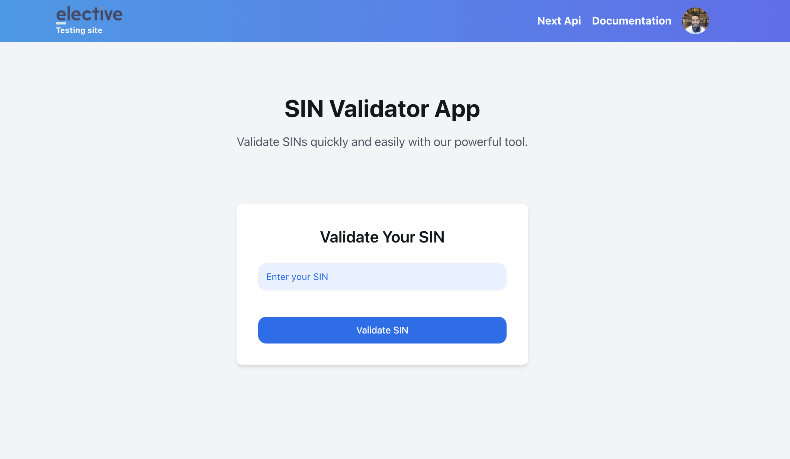

# SIN Validator

## Overview

The SIN Validator is a web application designed to validate Canadian Social Insurance Numbers (SINs). It utilizes the Luhn algorithm to ensure that the provided SIN is valid and consists of exactly 9 digits, ignoring any spaces. The application is built with Next.js (TypeScript), NextUI for UI components (Tailwind), and Zod for validation.



## Features

- Validate SINs with a user-friendly interface.
- Ignore spaces in input validation.
- Built using modern technologies like Next.js, React, and TypeScript.

## Installation

This project is recommended to be installed using [pnpm](https://pnpm.io/) instead of npm for several reasons:

- **Performance**: `pnpm` uses a content-addressable filesystem to store all files in a single place, which speeds up installation times.
- **Disk Space Efficiency**: It creates hard links from a single version of a package stored on your disk, thus saving space.
- **Deterministic Installs**: `pnpm` ensures that the same dependencies are installed in the same way on every machine, reducing inconsistencies across development environments.

### Prerequisites

Make sure you have `pnpm` installed. If you don't have it yet, you can install it globally using npm:

```bash
npm install -g pnpm
```

### Run Project

- pnpm install
- pnpm dev
- This project will Run On [http://localhost:3000/](http://localhost:3000/)

## Tests

This program comes with a test validator using JEST for the SIN algorithm.

To run the tests, use the following command:

```bash
pnpm test
```

## API

- **URL**: `/api/validate/{SIN}`
- **Method**: `GET`

### Description

This endpoint validates the provided Social Insurance Number (SIN) and returns a JSON object indicating whether the SIN is valid or not.

### Response

The response will be a JSON object with the following structure:

```json
{
  "isValid": boolean,
  "errors": string[]
}
```

### Example

To validate a SIN, you can make a request to the following URL:

```bash
/api/validate/046454286
```

Sample Response:

```json
{
  "isValid": true
}
```
